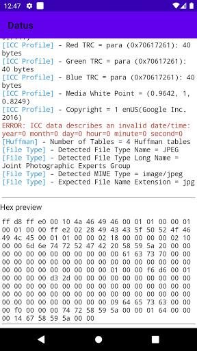
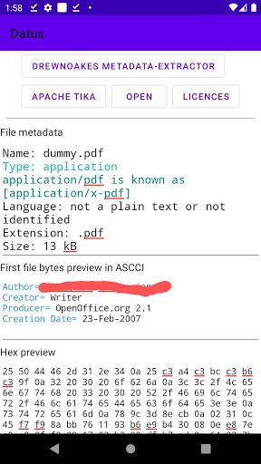
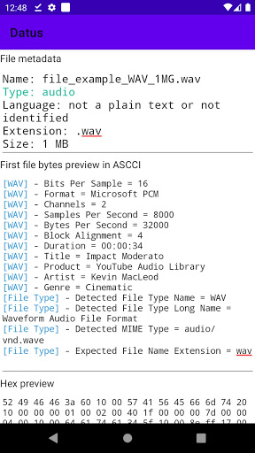
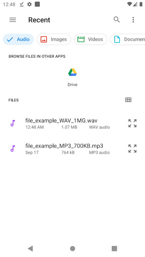

# Datus

Datus is probably the strongest "file extension detector and metadata extractor". 

It is based on both "Apache Tika project" and "drewnoakes's metadata-extractor". 

The Apache Tika™ toolkit detects and extracts metadata and text from over a thousand different file types (such as PPT, XLS, and PDF) based on their content rather than just name. 

Tika solution and metadata-extractor were successfully used as back-end in this very simple Android application. 

It does not connect to any server; So it is 100% offline.

UI:

# Contribution

Please see open issues for a specific issue, and do not hesitate to open any new issue (like better code, readability, modularity and best practice, performance, better UI or even functionality enhancements...).

Please know that I am not a keen Android developer, but I successfully made this tiny Android app available on Play Store here https://play.google.com/store/apps/details?id=com.bacloud.datus

If you contribute, please consider that I can merge and publish a new release under that channel, It will be 100% free for Android users on Play store and anywhere, although I can add ads to generate some coffee expenses :)

If you want to maintain the project with me, you can alwayse ask.

Please keep it fair if you want to deploy anywhere, ask for permission.

Sweet coding !
